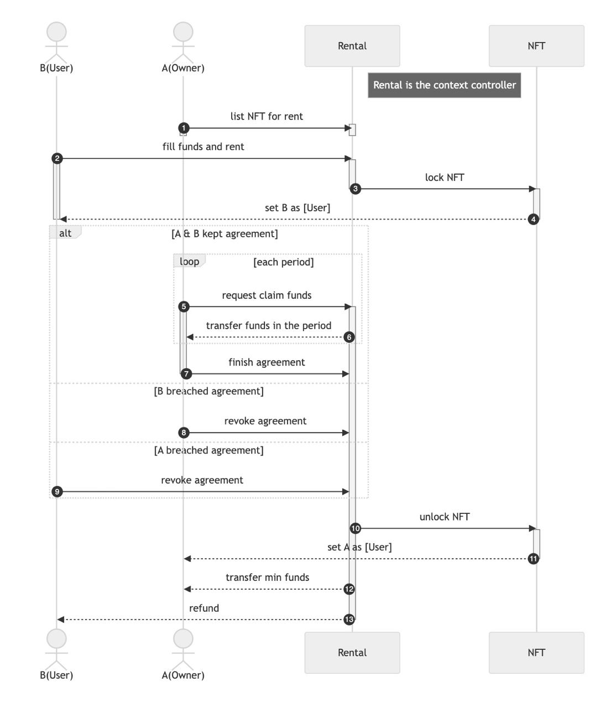

# REP-0015: ERC721 Extension with Context Roles

## Preamble

<pre>
REP-0015
Title: ERC721 Extension with Context Roles
Author: Sky Mavis Core Team
Type: Token Standard Track
Status: Draft
Created: 2024-04-02
</pre>

## Abstract

This introduces an extension for ERC721 Non-Fungible Tokens (NFTs): providing contexts and differentiating owner and ownership rights for a token to use in several use cases of mortgage, staking, rental, or delegation.

## Motivation

Because there is only an Owner role indicating the ownership rights, developing on top of ERC721 has often posed challenges.

Many decentralized applications (dApps) recognize token ownership as proof that the token owner is entitled to benefits within the rewarding systems, such as airdrops or tiered rewards. If token owners get their tokens to be locked in contracts (e.g. staking, rental, etc) they are not eligible to receive benefits from holding tokens, or the rewarding systems have to support as many contracts as possible to help these owners.

This proposal can facilitate serval use cases by contextualizing the use case and distinguishing ownership rights from other roles at the standard level. By standardizing these measures, dApps developers can more easily construct infrastructure and protocols on top of this standard.

## Specification

### Overview

This standard introduces:

- **Token Context**: provides a specified use case of a token. In a specified context there are 2 roles:
  - **Controller**: this role has permission to control the context.
  - **User**: the primary user of a token in a certain context.
- **Token Master**: The primary function of this role is to distinguish between owner and ownership rights, primarily focusing on holding ownership rights.

**Token Context**

It is where tokens can be delegated to users to use in a certain context. Token users can be optionally set by context controllers, in cases if they are not set, the token owner must be referenced by default. Context controllers have the ability to (un)lock an attached token.

**Token Master**

This role has permission such as transferring ownership and managing the addition or removal of tokens from contexts. Token master is updated when:

- Token transferred: the address will be referenced to the new owner.
- Master renounced: the address will be referenced to the current owner.
- Role transferred: the address will be referenced to the new token master.

**Roles**

| Roles             | Permission                                                                                                               | Quantity per Token |
| ----------------- | ------------------------------------------------------------------------------------------------------------------------ | ------------------ |
| Owner             | • Default `User` of all contexts                                                                                         | $1$                |
| Master            | • Transfers `Master` role<br>• Transfers `Owner` role<br>• Attaches/detaches their token to/from 1 or many `Context`     | $1$                |
| **Context Roles** |                                                                                                                          | $n$                |
| Controller        | • Transfers `Controller` role<br>• Grants a `User` role<br>• (Un)locks transfers<br>• Detaches a token from this context | $1$ per context    |
| User              | • Transfers `User`                                                                                                       | $1$ per context    |

Each role holder can transfer their role to another account to maintain the operation, except the owner.

**Entity Relationship Diagram**


### Mechanism

**Locking**

A token can be (un)locked from transferring by any attached context.

The locking mechanism can be disabled if the token masters request to detach their tokens from contexts, but their requests must be delayed for security reasons. If the token is not locked by any context, the request can be invoked immediately.

**Token Transferring**

In addition to extending from ERC721 for the transfer mechanism when transferring an NFT, the implementation must:

- Detach all attached contexts.
- Grant the new owner the token master role.

### Interface

Smart contracts implementing this standard must implement the ERC-165 `supportsInterface` function and must return the constant value `true` if `0xf37da6fa` is passed through the `interfaceID` argument.

```solidity
interface IREP15 /* is IERC721, IERC165 */ {
  /// @dev This emits when an context is updated by any mechanism.
  event ContextControllerSet(bytes32 indexed ctxHash, address indexed by, address indexed controller);
  /// @dev This emits when the token master role is started to transfer to a new address.
  event TokenMasterTransferStarted(uint256 indexed tokenId, address indexed previousMaster, address indexed newMaster);
  /// @dev This emits when the token master role is transferred to a new address.
  event TokenMasterTransferred(uint256 indexed tokenId, address indexed previousMaster, address indexed newMaster);
  /// @dev This emits when a token is attached to a certain context.
  event ContextAttachmentUpdated(bytes32 indexed ctxHash, uint256 indexed tokenId, address indexed user);
  /// @dev This emits when a token is requested to detach to a certain context.
  event ContextDetachRequested(bytes32 indexed ctxHash, uint256 indexed tokenId);
  /// @dev This emits when a token is requested to detach to a certain context.
  event ContextDetached(bytes32 indexed ctxHash, uint256 indexed tokenId);
  /// @dev This emits when a context locking is updated.
  event ContextLockUpdated(bytes32 indexed ctxHash, uint256 indexed tokenId, bool locked);

  ///////////////////////////////////////////////
  ////////////////////////////// CONTEXT MANAGING
  ///////////////////////////////////////////////

  /// @dev Returns the context controller address.
  function getContextController(bytes32 ctxHash) external view returns (address controller);

  /// @dev Creates a new context.
  /// Reverts if the context hash is already existent.
  /// Emits event {ContextControllerSet}.
  function createContext(bytes calldata salt, address controller) external returns(bytes32 ctxHash);

  /// @dev Transfers controller role of a context to a new address.
  /// Reverts if method caller is not the current controller.
  /// Emits event {ContextControllerSet}.
  function transferContextController(bytes32 ctxHash, address newController) external;

  ///////////////////////////////////////////////
  ///////////////////////// TOKEN MASTER MANAGING
  ///////////////////////////////////////////////

  /// @dev Returns the address of current token master.
  function getTokenMaster(uint256 tokenId) external view returns(address);

  /// @dev Returns the pending token master.
  function pendingTokenMaster(uint256 tokenId) external view returns(address);

  /// @dev Starts transferring token master role.
  /// Reverts if method caller is not the current master.
  /// Emits event {TokenMasterTransferStarted}.
  function transferTokenMaster(uint256 tokenId, address newMaster) external;

  /// @dev Accepts request transferring token master role.
  /// Reverts if method caller is not the current master.
  /// Emits event {TokenMasterTransferred}.
  function acceptTokenMaster(uint256 tokenId) external;

  /// @dev Renounces from being a token master.
  /// Reverts if:
  /// - The method caller is not the current master.
  /// - The method caller is owner.
  /// Emits event {TokenMasterTransferred}.
  function renounceTokenMaster(uint256 tokenId) external;

  ///////////////////////////////////////////////
  //////////////////////// TOKEN CONTEXT MANAGING
  ///////////////////////////////////////////////

  /// @dev Returns the duration has to wait to unlock for any request detaching.
  function detachDelayDuration() external view returns(uint256);

  /// @dev Returns whether a token is attached with a certain token.
  function isAttachedWithContext(bytes32 ctxHash, uint256 tokenId) external view returns(bool);

  /// @dev Attaches a token with a certain context.
  /// Revert if the method caller is not token master.
  /// Emits event {ContextAttachmentUpdated}.
  function attachContext(bytes32 ctxHash, uint256 tokenId) external;

  /// @dev Detaches a token with a certain context.
  /// Revert if the method caller is not token master.
  /// Emits event {ContextDetachRequested} if the token contexts are locking.
  /// Emits event {ContextDetached} if the token contexts are not locking.
  function requestDetachAllContext(uint256 tokenId) external;

  /// @dev See {requestDetachAllContext}.
  /// Revert if the method caller is not token master nether controller.
  function requestDetachContext(bytes32 ctxHash, uint256 tokenId) external;

  /// @dev Detaches a token with a certain context.
  /// Revert if the method caller is not token master.
  /// Emits event {ContextDetached} if the token contexts are not locking.
  function execDetachAllContext(uint256 tokenId) external;

  ///////////////////////////////////////////////
  ///////////////////////// CONTEXT USER MANAGING
  ///////////////////////////////////////////////

  /// @dev Returns the user of a token in a certain context.
  function getContextUser(bytes32 ctxHash, uint256 tokenId) external view returns(address user);

  /// @dev Sets the context user.
  /// Revert if the method caller is not context controller nether current user.
  /// Emits event {ContextAttachmentUpdated}.
  function setContextUser(bytes32 ctxHash, uint256 tokenId) external;

  ///////////////////////////////////////////////
  ////////////////////// CONTEXT LOCKING MANAGING
  ///////////////////////////////////////////////

  /// @dev Returns the locking status of a token in a certain context.
  function getContextLock(bytes32 ctxHash, uint256 tokenId) external view returns(bool locking);

  /// @dev Sets context locking status.
  /// Revert if the method caller is not context controller.
  /// Emits event {ContextLockUpdated}.
  function setContextLock(bytes32 ctxHash, uint256 tokenId, bool locking) external;
}
```

The enumeration extension is optional for REP15 smart contracts. This allows your contract to publish its full list of context and make them discoverable. When calling the `supportsInterface` function must return the constant value `true` if `0xcebf44b7` is passed through the `interfaceID` argument.

```solidity
interface IREP15Enumerable /** is IREP15 */  {
  /// @dev Returns a created context in this contract at `index`.
  /// An index must be a value between 0 and {getContextCount}, non-inclusive.
  /// Note: When using {getContext} and {getContextCount}, make sure you perform all queries on the same block.
  function getContext(uint256 index) external view returns(bytes32 ctxHash);

  /// @dev Returns the number of context created in contract.
  function getContextCount() external view returns(uint256);

  /// @dev Returns a context attached with a token at `index`.
  /// An index must be a value between 0 and {getAttachedContextCount}, non-inclusive.
  /// Note: When using {getAttachedContext} and {getAttachedContextCount}, make sure you perform all queries on the same block.
  function getAttachedContext(uint256 tokenId, uint256 index) external view returns(bytes32 ctxHash);

  /// @dev Returns the number of context attached with the token.
  function getAttachedContextCount(uint256 tokenId) external view returns(uint256);
}
```

## Security Consideration

## Detaching delay time

When developing a token intended to serve multiple contexts, the contract deployer should anticipate potential use cases and establish an appropriate delay time for detaching tokens from contexts. This precaution is essential to mitigate the risk of the owner and token master abusing rental/mortgage systems by spamming listings and transferring tokens to another owner in a short time.

## Duplicated token usage

When initiating a new context, the context controllers should track all other contexts within the NFT contract to prevent duplicated usage.

For example, suppose a scenario where a token is locked for rental purposes within a particular game. If that game introduces another context (e.g. supporting delegation in that game), it could lead to duplicated token usage within the game, despite being intended for different contexts.

In such cases, a shared context for rental and delegation purposes can be considered. Or there must be some restrictions on the new delegation context to prevent reusing that token in the game.

## Typical Use Cases

### Mortgage

This is a typical use case for mortgages, supposing A(owner) owns a token and wants to mortgage, and B(lender) wants to earn interest by lending their funds to A.


### Rental

This is a typical use case for rentals, supposing A(owner) owns a token and wants to list his/her token for rent, and B(user) wants to rent the token to play in a certain game.



## Reference

- [ERC-721 Non-Fungible Token Standard](https://eips.ethereum.org/EIPS/eip-721)
- [ERC-165 Standard Interface Detection](https://eips.ethereum.org/EIPS/eip-165)
- [ERC-2615: Non-Fungible Token with mortgage and rental functions](https://eips.ethereum.org/EIPS/eip-2615)
