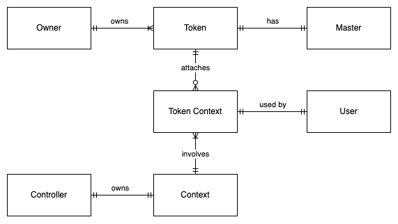
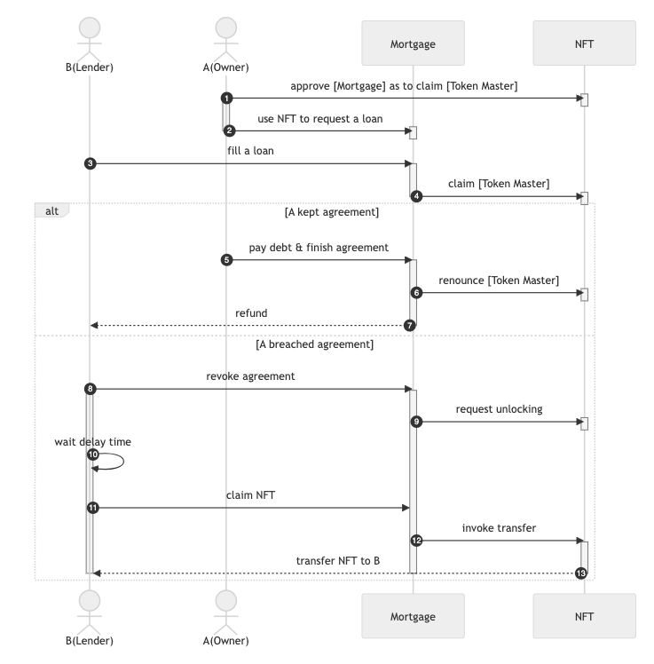
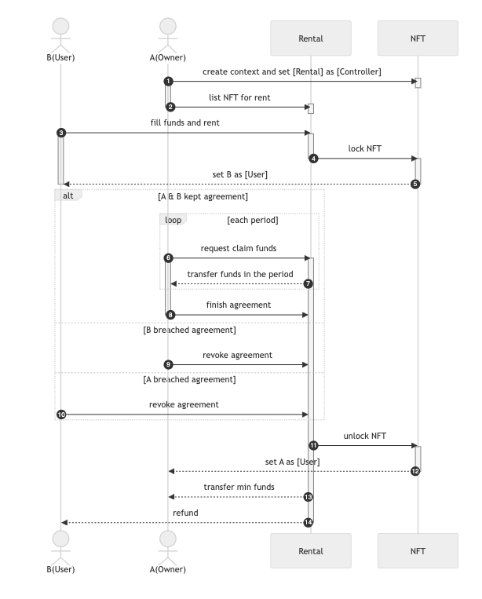

# REP-0015: Context Roles for ERC721

## Preamble

<pre>
REP-0015
Title: Context Roles for ERC721
Author: Ronin Core Team
Type: Token Standard Track
Status: Draft
Created: 2024-04-02
</pre>

## Abstract

This introduces an extension to ERC721 Non-Fungible Tokens (NFTs) to provide contexts and to differentiate owner and ownership rights for a token.

## Motivation

Developing on top of ERC721 has often posed challenges, as many decentralized applications (dApps) recognize token ownership as proof that the owner is entitled to benefits within the protocol, such as airdrops or tiered rewards. Because there is only an Owner role indicating for the ownership rights.

This proposal can facilitate serval use cases, including mortgage, rental, staking, delegating, and more by contextualizing the use case and distinguishing ownership rights from other roles at the standard level. By standardizing these measures, developers can more easily construct infrastructure and protocols on top of this standard.

## Specification

### Token Context

The token context provides a specified use case of a token, where tokens can be delegated to users to use in a certain context. Token users can be optionally set by context controllers, in cases of they are not set, the token owner is referenced by default.

Context controllers have the ability to (un)lock an attached token.

### Token Master

The primary function of this role is to distinguish between owner and ownership rights, primarily focusing on holding ownership rights, which involve permission such as transferring ownership and managing the addition or removal of tokens from contexts.

Token master is updated when:

- Token transferred: the address will be referenced to the new owner.
- Master renounced: the address will be referenced to the current owner.
- Role transferred: the address will be referenced to the new token master.

### Token Locking

A token can be (un)locked from transferring by any attached context.

The locking mechanism can be disabled if the token masters request to detach their tokens from contexts, but their requests must be delayed for security reasons. If the token is not locked by any context, the request can be invoked immediately.

### Roles

| Roles             | Permission                                                                                                               | Quantity per Token |
| ----------------- | ------------------------------------------------------------------------------------------------------------------------ | ------------------ |
| Owner             | • Default `User` of all contexts                                                                                         | $1$                |
| Master            | • Transfers `Master` role<br>• Transfers `Owner` role<br>• Attaches/detaches their token to/from 1 or many `Context`     | $1$                |
| **Context Roles** |                                                                                                                          | $n$                |
| Controller        | • Transfers `Controller` role<br>• Grants a `User` role<br>• (Un)locks transfers<br>• Detaches a token from this context | $1$ per context    |
| User              | • Transfers `User`                                                                                                       | $1$ per context    |

Each role holder can transfer their role to another account to maintain the operation, except the owner.

### ERD



## Interface

```solidity
interface IERC721Extension is IERC721 {
  /// @dev This emits when an context is updated by any mechanism.
  event ContextControllerSet(bytes32 indexed ctxHash, address indexed by, address indexed controller);
  /// @dev This emits when the token master role is transferred to a new address.
  event TokenMasterTransferred(uint256 indexed tokenId, address indexed previousMaster, address indexed newMaster);
  /// @dev This emits when a token is attached to a certain context.
  event ContextAttachmentUpdated(bytes32 indexed ctxHash, uint256 indexed tokenId, address indexed user);
  /// @dev This emits when a token is requested to detach to a certain context.
  event ContextDetachRequested(bytes32 indexed ctxHash, uint256 indexed tokenId);
  /// @dev This emits when a token is requested to detach to a certain context.
  event ContextDetached(bytes32 indexed ctxHash, uint256 indexed tokenId);
  /// @dev This emits when a context locking is updated.
  event ContextLockUpdated(bytes32 indexed ctxHash, uint256 indexed tokenId, bool locked);

  ///////////////////////////////////////////////
  ////////////////////////////// CONTEXT MANAGING
  ///////////////////////////////////////////////

  /// @dev Returns the context controller address.
  function getContextController(bytes32 ctxHash) view returns (address controller);

  /// @dev Creates a new context.
  /// Reverts if the context hash is already existent.
  /// Emits event {ContextControllerSet}.
  function createContext(bytes salt, address controller) returns(bytes32 ctxHash);

  /// @dev Transfers controller role of a context to a new address.
  /// Reverts if method caller is not the current controller.
  /// Emits event {ContextControllerSet}.
  function transferContextController(bytes32 ctxHash, address newController);

  ///////////////////////////////////////////////
  ///////////////////////// TOKEN MASTER MANAGING
  ///////////////////////////////////////////////

  /// @dev Returns the address of current token master.
  function getTokenMaster(uint256 tokenId) external view returns(address);

  /// @dev Starts transferring token master role.
  /// Reverts if method caller is not the current master.
  /// Emits event {TokenMasterTransferred}.
  function transferTokenMaster(uint256 tokenId, address newMaster) external;

  /// @dev Renounces from being a token master.
  /// Reverts if:
  /// - The method caller is not the current master.
  /// - The method caller is owner.
  /// Emits event {TokenMasterTransferred}.
  function renounceTokenMaster(uint256 tokenId) external;

  ///////////////////////////////////////////////
  //////////////////////// TOKEN CONTEXT MANAGING
  ///////////////////////////////////////////////

  /// @dev Returns the duration has to wait to unlock for any request detaching.
  function detachDelayDuration() external view returns(uint256);

  /// @dev Returns whether a token is attached with a certain token.
  function isAttachedWithContext(bytes32 ctxHash, uint256 tokenId) external view returns(bool);

  /// @dev Attaches a token with a certain context.
  /// Revert if the method caller is not token master.
  /// Emits event {ContextAttachmentUpdated}.
  function attachContext(bytes32 ctxHash, uint256 tokenId) external;

  /// @dev Detaches a token with a certain context.
  /// Revert if the method caller is not token master.
  /// Emits event {ContextDetachRequested} if the token contexts are locking.
  /// Emits event {ContextDetached} if the token contexts are not locking.
  function requestDetachAllContext(uint256 tokenId) external;

  /// @dev See {requestDetachAllContext}.
  /// Revert if the method caller is not token master nether controller.
  function requestDetachContext(bytes32 ctxHash, uint256 tokenId) external;

  /// @dev Detaches a token with a certain context.
  /// Revert if the method caller is not token master.
  /// Emits event {ContextDetached} if the token contexts are not locking.
  function execDetachAllContext(uint256 tokenId) external;

  ///////////////////////////////////////////////
  ///////////////////////// CONTEXT USER MANAGING
  ///////////////////////////////////////////////

  /// @dev Returns the user of a token in a certain context.
  function getContextUser(bytes32 ctxHash, uint256 tokenId) external view returns(address user);

  /// @dev Sets the context user.
  /// Revert if the method caller is not context controller nether current user.
  /// Emits event {ContextAttachmentUpdated}.
  function setContextUser(bytes32 ctxHash, uint256 tokenId) external;

  ///////////////////////////////////////////////
  ////////////////////// CONTEXT LOCKING MANAGING
  ///////////////////////////////////////////////

  /// @dev Returns the user of a token in a certain context.
  function getContextLock(bytes32 ctxHash, uint256 tokenId) external view returns(bool locking);

  /// @dev Sets context locking status.
  /// Revert if the method caller is not context controller.
  /// Emits event {ContextLockUpdated}.
  function setContextLock(bytes32 ctxHash, uint256 tokenId, bool locking);
}
```

## Security Consideration

## Detaching delay time

When developing a token intended to serve multiple contexts, the contract deployer should anticipate potential use cases and establish an appropriate delay time for detaching tokens from contexts. This precaution is essential to mitigate the risk of the owner and token master abusing rental/mortgage systems by spamming listings and transferring tokens to another owner in a short time.

## Duplicated token usage

When initiating a new context, the context controllers should track all other contexts within the NFT contract to prevent duplicated usage.

For example, suppose a scenario where a token is locked for rental purposes within a particular game. If that game introduces another context, it could lead to duplicated token usage within the game, despite being intended for different contexts.

## Typical Use Cases

### Mortgage



This is a typical use case for mortgages, supposing A(owner) owns a token and wants to mortgage, and B(lender) wants to earn interest by lending their funds to A.

### Rental



This is a typical use case for rentals, supposing A(owner) owns a token and wants to list his/her token for rent, and B(user) wants to rent the token to play in a certain game.
