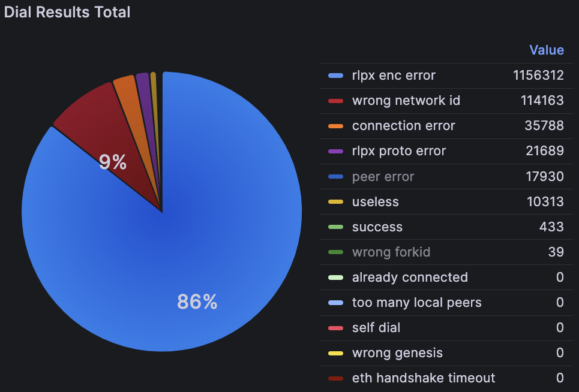
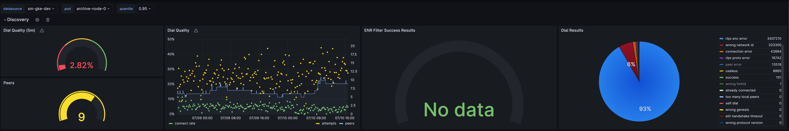
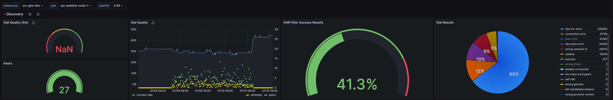
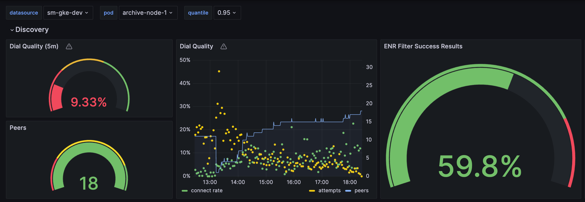

<pre>
REP-00018
Title: Node Discovery ENR Filtering
Author: Harry Ngo (@huyngopt1994)
Type: Networking Track
Status: Executed
Created: 2024-07-15
</pre>

# REP-00018: Node Discovery ENR Filtering

- [REP 18: Node Discovery ENR filtering](#REP-00018-node-discovery-enr-filtering)
	- [1. Summary](#1-summary)
	- [2. Motivation](#2-motivation)
	- [3. Specification](#3-specification)
	- [4. Benchmarking](#4-benchmarking)
	- [5. Reference](#5-reference)

## 1. Summary
This REP introduces node discovery filtering based on ENR records in Ronin Chain.

## 2. Motivation

Current implementation of discovery protocol is chain agnostic and does not differentiate between different chains (ETH, Ronin, ...). The discover protocol currently gossips peers from networks with different chain ids. This causes a pretty significant slowdown during peer discovery.

As we can see, in current mainnet, we get a lot wrong network id errors when dialing.



*Figure 1: Dial Result Total for a node in Mainnet*

## 3. Specification

Node discovery protocol uses distributed hash tables (DHTs) that are exchanged between nodes via p2p. We will introduce a new filtering step that will filter out nodes before insertion to the table based on their ENR records.

```
// Record represents a node record. The zero value is an empty record.
type Record struct {
   seq       uint64 // sequence number
   signature []byte // the signature
   raw       []byte // RLP encoded record
   pairs     []pair // sorted list of all key/value pairs
}
```
*Code 1: Current ENR record structure layout*

ENR record consists of key-value pairs. One of these key-value pairs is the eth key which has a genesis hash value. Based on genesis hash we can filter out nodes that are running a different chain id.

```
func (eth *Ethereum) currentEthEntry() *ethEntry {
   return &ethEntry{ForkID: forkid.NewID(eth.blockchain.Config(), eth.blockchain.Genesis().Hash(),
       eth.blockchain.CurrentHeader().Number.Uint64())}
}
```

*Code 2: eth entry generation function*

We would introduce new flag for boot-nodes :

```
-network <ronin-mainnet/ronin-testnet> filters nodes by "eth" ENR entry
```

*Code 3: Filtering logic*

```
	// ENR filter function
	f := func(r *enr.Record) bool {
		if srv.forkFilter == nil {
			return true
		}
		var eth struct {
			ForkID forkid.ID
			Tail   []rlp.RawValue `rlp:"tail"`
		}
		if r.Load(enr.WithEntry("eth", &eth)) != nil {
			return false
		}
		return srv.forkFilter(eth.ForkID) == nil
	}
```

## 4. Benchmarking

We are experimenting 2 groups of nodes which are applying ENR filtering and not which running 4 days in Testnet.

### Result after running 4 days.



*Figure 2: Without Applying ENR Filtering P2P Metrics*



*Figure 3: Applying ENR Filtering P2P Metrics*

Overall, the quality of peering has improved when comparing before and after the changes. The error rate significantly decreased from approximately 200,000 to nearly 29,000 within four days, leading to a reduction in ineffective TCP communications. Additionally, the number of peerings has increased, ranging from 10 to 27.


### Result Reapply ENR Filtering 

We plan to reapply ENR filtering logic to existing nodes, as depicted in Figure 2, which are experiencing poor peering, to assess any improvements in peering quality.



*Figure 4: Reapplying ENR Filtering P2P Metrics to existed node*

After running for 5 hours, peering increases to 18, with the distribution of the connection rate surpassing previous figures. The connection rate is predominantly over 10%, which is an improvement from before.

## 5. Reference

ENR: https://github.com/ethereum/devp2p/blob/master/enr.md

Node Discovery Protocol: https://github.com/ethereum/devp2p/blob/master/discv4.md


## 6. License

The content is licensed under [CC0](https://creativecommons.org/publicdomain/zero/1.0/).
